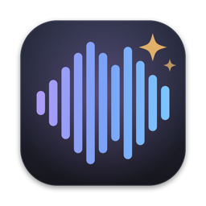

<p align="center">
  
</p>

<h1 align="center">MusicStudio</h1>

<p align="center">
  A native macOS workstation for generating full songs on your own Mac with local MLX music models.<br>
  No cloud, no subscription: prompts, lyrics, models and audio all stay on your machine.
</p>

<p align="center">
  <a href="https://github.com/rayone/MusicStudio/releases/latest">Download</a> ·
  <a href="docs/USER_GUIDE.md">User guide</a> ·
  <a href="docs/ARCHITECTURE.md">Architecture</a> ·
  <a href="docs/BUILDING.md">Build &amp; release</a> ·
  <a href="docs/TROUBLESHOOTING.md">Troubleshooting</a>
</p>

---

## What it does

MusicStudio turns a style description plus lyrics into a finished, mastered, tagged audio file. It wraps two open text-to-music model families in one SwiftUI app:

| Model family | How it works | Best for |
|---|---|---|
| **MiniMax Music 3** (4bit / 6bit / mxfp8 / 8bit / bf16) | Diffusion transformer with flow matching. Takes a structured music prompt. 44.1 kHz output. | Polished, radio-style mixes from a detailed prompt |
| **YuE2-3B** (8bit / bf16) | Language model that can first write a symbolic ABC score (chords + melody), then renders audio from it. 48 kHz output. | Songs where melody and harmony structure matter, or when you want to supply your own score |

Around the models it gives you:

- **A style library of >1000 presets** with two search modes: AI Search (semantic, on-device embeddings), which is the default, and exact keyword Text Match. Filter by key, scale, vocal, meter, register and language.
- **A lyrics editor** with one-click structure tags (`[Verse]`, `[Chorus]`, …) and a live token budget.
- **An ABC score editor** for YuE2's symbolic planning ("CoT mode"). It only appears when the selected mode actually uses a score.
- **A persistent render queue** with batches, seed locking, pause/resume and ETAs calibrated from your own past renders.
- **Automatic post-processing:** loudness normalisation to −14 LUFS / −1 dBTP, conversion to WAV, MP3, M4A or FLAC, and rich metadata tags. The untouched render is kept as `_raw.wav`.
- **A Studio tab** for reviewing tracks: spectrogram, measured tempo, key, loudness and spectral analysis, live Audio Unit effects and offline VST3 effects. A mastering chain (EQ, air lift, artifact reduction) is available from the [command line](docs/CLI.md#master).
- **SongBench quality scoring** across 7 musical dimensions (academic use only; see [Licensing](#licensing)).
- [**Songwriter integration:**](https://github.com/rayone/songwriter) import ready-made songs from a [Songwriter](docs/songwriter-api-contract.md) server and report results back. Imported songs are saved as `[Title]_[Timestamp].mp3`.


## Requirements

| | Minimum | Recommended |
|---|---|---|
| Mac | Apple Silicon (M1 or later) | M2 Pro / M3 Max or better |
| macOS | 14 Sonoma | 15 or later |
| Unified memory | 16 GB (MiniMax 4bit, YuE2 8bit) | 32 GB+ (MiniMax mxfp8) |
| Disk | ~15 GB (app env + one model) | 40 GB+ for several models |
| Network | Needed on first launch and for model downloads | — |

Intel Macs are not supported, because MLX requires Apple Silicon.

## Quick start

### Option A: download the release

1. Download `MusicStudio-0.1.0.dmg` from the [latest release](https://github.com/rayone/MusicStudio/releases/latest) and check it against the published `.sha256`:
   ```bash
   shasum -a 256 -c MusicStudio-0.1.0.dmg.sha256
   ```
2. Open the DMG and drag **MusicStudio.app** into the **Applications** folder.
3. v0.1.0 is ad-hoc signed, not notarized. Before the first launch, either right-click the app → **Open** → **Open**, or clear the download quarantine flag:
   ```bash
   xattr -dr com.apple.quarantine /Applications/MusicStudio.app
   ```
4. Launch it. The first-run screen shows your hardware profile and installs the Python engine, which takes 5–15 minutes depending on your connection. See [First launch](docs/USER_GUIDE.md#1-first-launch).
5. Open **Settings → Models** (or Help → Model Catalog & Downloads…) and download a model. The app highlights the best fit for your RAM.
6. Pick a preset, write or paste lyrics, and press **⌘↩** to queue your first song.

### Option B: build from source

```bash
xcode-select --install          # Swift compiler, if not already installed
git clone https://github.com/rayone/MusicStudio.git
cd MusicStudio
./run.command                   # builds MusicStudio.app if needed, then opens it
```

`./build.command --release` produces a distributable zip in `dist/`. Signing and notarization are covered in [docs/BUILDING.md](docs/BUILDING.md).

## Your first song in 60 seconds

1. **Pick a model** from the header dropdown. If you're unsure, start with YuE2-3B 8bit on 24 GB Macs or MiniMax mxfp8 on 32 GB+.
2. **Find a style.** Type a vibe in the search bar, such as "dark cyberpunk synth" or "sad piano ballad". AI Search finds presets by meaning, not exact words. Click one to load its prompt.
3. **Add lyrics** in the Lyrics panel and use the tag buttons for structure, or tick **Instrumental**.
4. **Set length and quality.** Use Duration (10–360 s) and Steps (more is slower and usually cleaner). The defaults are tuned per model.
5. Press **⌘↩ (Add to Queue)**. Watch progress in the header ETA. Press **⌘K** to see the live engine console.
6. Your track appears in **Generation History**. Play it, open the folder, or switch to the **Studio** tab (⌘2) to analyse, master or apply plugins.

The [User Guide](docs/USER_GUIDE.md) walks through every panel, setting and shortcut.

## Where things live

| What | Location |
|---|---|
| App data root | `~/.MusicStudio/` |
| Rendered songs | `~/.MusicStudio/output/` (change in Settings → Storage) |
| Model weights | `~/.MusicStudio/models/` (change in Settings → Storage) |
| Database (history, queue, presets) | `~/.MusicStudio/studio.db` |
| Automatic DB backups (before migrations, keeps 5) | `~/.MusicStudio/backups/` |
| Python engine environment | `~/.MusicStudio/venv/` |
| Preferences | `defaults read ai.opencode.mlx.musicstudio` |

To uninstall completely, delete `MusicStudio.app` and `~/.MusicStudio/`, then run `defaults delete ai.opencode.mlx.musicstudio`. This also deletes your songs and models, so move `output/` somewhere safe first.

## Documentation

- [User Guide](docs/USER_GUIDE.md): every feature, setting and shortcut, plus how-tos.
- [Architecture](docs/ARCHITECTURE.md): how the Swift app, Python engine, database and models fit together.
- [Building & Releasing](docs/BUILDING.md): build from source, sign, notarize and publish.
- [Command-line engine](docs/CLI.md): drive `studio.py` directly from scripts.
- [Troubleshooting](docs/TROUBLESHOOTING.md): common errors and fixes.
- [Songwriter API contract](docs/songwriter-api-contract.md): integration protocol.
- [Changelog](CHANGELOG.md) · [Contributing](CONTRIBUTING.md) · [Security](SECURITY.md)

## Licensing

MusicStudio's own code (the Swift app and `Resources/studio.py`) is released under the [MIT License](LICENSE).

Bundled and downloaded third-party components keep their own licenses. They are listed in [NOTICE.md](NOTICE.md). Two points matter in practice:

- **SongBench (`Resources/songbench/`) is licensed by Tencent for academic use only.** Do not use the SongBench quality-scoring feature for commercial or production purposes. Everything else in the app works without it.
- **Model weights** are downloaded from Hugging Face under their publishers' licenses. Check each model card before using generated audio commercially.

## Acknowledgements

Built on [MLX](https://github.com/ml-explore/mlx), [mlx-audio](https://github.com/Blaizzy/mlx-audio), [MiniMax Music](https://huggingface.co/mlx-community), [YuE](https://github.com/multimodal-art-projection/YuE) / [mlx-Yue](https://github.com/vanch007), [SongBench](https://github.com/Tencent/SongBench) / [MuQ](https://github.com/tencent-ailab/MuQ), [Spotify Pedalboard](https://github.com/spotify/pedalboard), [librosa](https://librosa.org) and [uv](https://github.com/astral-sh/uv).
