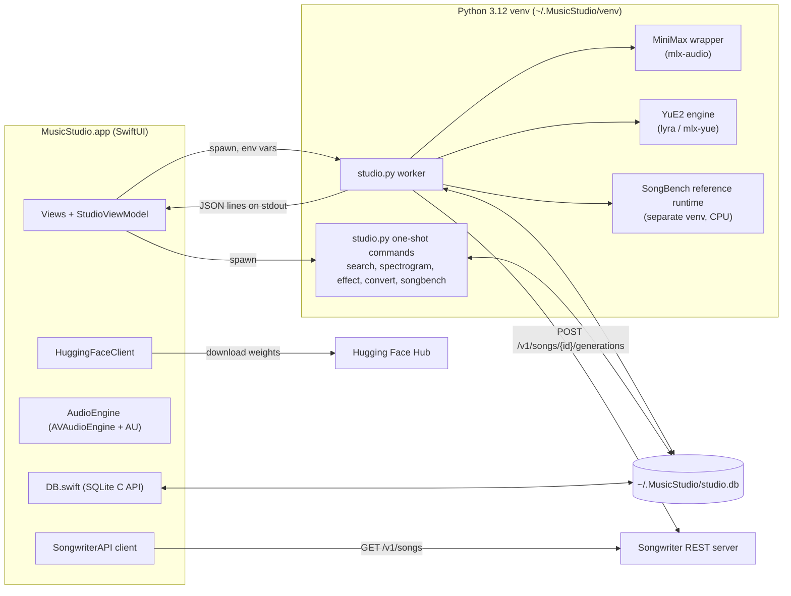
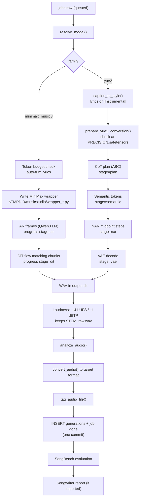
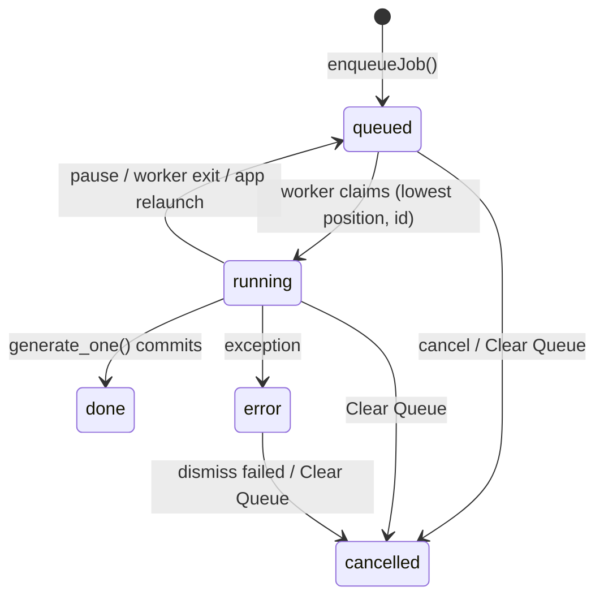
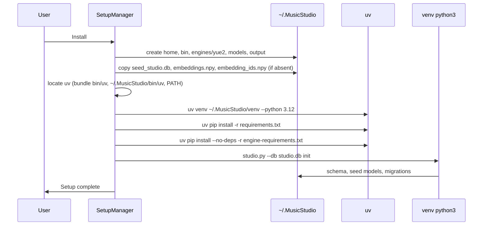

# MusicStudio Architecture

This document explains how MusicStudio is put together: which process does what, how a song moves from the Create tab to a tagged audio file, where state lives, and why some things are the way they are. It describes v0.1.0. For building from source see [BUILDING.md](BUILDING.md); for user-facing problems see [TROUBLESHOOTING.md](TROUBLESHOOTING.md).

## Overview

MusicStudio is a native SwiftUI app with a Python engine. The Swift side owns the UI, the job queue UI, playback, Audio Unit hosting, model downloads and the Songwriter import client. Everything that touches ML models or heavy audio DSP runs in Python (`Resources/studio.py`), launched as child processes from the app. The two sides share one SQLite database and talk through command-line arguments, environment variables, and newline-delimited JSON on stdout.



## Repository layout

| Path | Purpose |
|---|---|
| `Sources/Main.swift` | `@main` app. Shows `SetupView` until setup is ready, then `ContentView`. Defines menus and keyboard shortcuts. |
| `Sources/StudioViewModel.swift` | Central `ObservableObject`. Holds Create/Studio state, spawns every Python process, parses worker events into logs and progress, computes ETAs, manages plugins and the sleep assertion. |
| `Sources/DB.swift` | Thin wrapper over the SQLite C API. Serial dispatch queue, WAL mode, 5 s busy timeout. Reads templates, history, queue; enqueues/cancels jobs; ETA calibration query. |
| `Sources/SetupManager.swift` | First-run bootstrap: directories, seed DB copy, `uv`, venv, pip installs, `studio.py init`. |
| `Sources/ModelCatalog.swift` | `ModelDefinition` / `ModelCapabilities` types, loads `catalog.json`, local availability check, RAM-based recommendation. |
| `Sources/SystemProfile.swift` | Reads RAM, chip name, performance cores, `iogpu.wired_limit_mb`, Metal limits. Maps RAM to recommended quantization. |
| `Sources/HuggingFace.swift` | Hub search, repo file tree, resumable-by-size file downloads, optional bearer token. |
| `Sources/SongwriterAPI.swift` | Songwriter client: URL/token validation, `GET /v1/songs`, `GET /v1/songs/{id}`, error strings. |
| `Sources/AudioEngine.swift` | Playback graph `AVAudioPlayerNode -> [AU effect] -> mainMixer`, plus offline AU rendering for saving. |
| `Sources/AudioUnitHost.swift` | Finds installed AU effects, resolves `.component` bundles, finds the AU/VST3 sibling, shows the plugin's own editor window. |
| `Sources/Models.swift` | Shared types: `CoTMode`, `AudioFormat`, `LogComponent`, `LogLevel`, worker `EventMessage`, history and queue rows. |
| `Sources/SaveFormatPicker.swift` | Format accessory view for the save panel. |
| `Sources/Theme.swift` | Colors and fonts. |
| `Sources/Views/ContentView.swift` | Main window: header, Create and Studio tabs, console. Shows the ABC editor only when `vm.usesAbcScore`. |
| `Sources/Views/StyleLibraryView.swift` | Preset library, filters, keyword chips, AI Search / Text Match toggle, prompt/tagline editor. |
| `Sources/Views/LyricsEditorView.swift` | Lyrics editor with family-specific section tag buttons. |
| `Sources/Views/AbcEditorView.swift` | ABC score editor (import, export, copy, clear). |
| `Sources/Views/ParameterView.swift` | Duration, steps, guidance, CoT, seed, format, batch, instrumental. |
| `Sources/Views/QueuePopoverView.swift` | Queue list, per-row ETA, pause/resume, clear, dismiss failed. |
| `Sources/Views/OutputAndHistoryView.swift` | Player bar, history list, SongBench pill. |
| `Sources/Views/StudioInspectorView.swift` | Track metadata, spectrogram, analysis groups, plugin panel. |
| `Sources/Views/ConsoleView.swift` | Log console with level/component/text filters, Copy and Clear. |
| `Sources/Views/ModelManagerView.swift` | Local catalog with download buttons and Hub explorer. |
| `Sources/Views/SettingsView.swift` | Settings sections: API, Models, Defaults, Layout, Storage. |
| `Sources/Views/SetupView.swift` | First-run screen: folder pickers, HF token, install button, progress, failure message. |
| `Sources/Views/SongwriterPopoverView.swift`, `SongwriterSettingsView.swift` | Songwriter song picker and settings. |
| `Sources/Views/NewTemplateSheet.swift` | Create a new style preset. |
| `Resources/studio.py` | The whole Python engine and CLI (schema, migrations, generation, analysis, tagging, conversion, search, plugins, mastering, Songwriter reporting). |
| `Resources/catalog.json` | Model catalog (ids, repos, quantization, sizes, RAM guidance, capabilities). Read by both Swift and Python. |
| `Resources/requirements.txt` | Pinned Python dependencies for the main venv. |
| `Resources/engine-requirements.txt` | YuE2 engine (`mlx-yue`, provides `lyra`), pinned to a commit, installed with `--no-deps`. |
| `Resources/seed_studio.db` | Seed database with the style preset library. |
| `Resources/embeddings.npy`, `Resources/embedding_ids.npy` | Precomputed AI Search vectors (5,678 x 1024, float32) and their prompt ids. |
| `Resources/songbench/` | SongBench evaluator integration (Tencent license, academic use only). |
| `Resources/songbench-reference-requirements.txt` | PyTorch/MuQ runtime for SongBench, installed into a separate venv on first evaluation. |
| `Resources/AppIcon.icns` | App icon. |
| `Resources/backups/` | Local DB backups from development. Excluded from the bundle by `build.command`. |
| `bin/uv` | Pinned `uv` 0.12.9 (arm64), copied into the bundle so setup needs no system package manager. |
| `build.command` | Compiles with `swiftc`, assembles `MusicStudio.app`, writes `Info.plist`, signs (ad-hoc by default), optionally zips/notarizes. |
| `run.command` | Rebuilds if the bundle is missing or any file in `Sources/`, `Resources/` or `build.command` is newer, then opens the app. |

## Process model

### How Swift launches Python

Every Python call is a `Process` running `~/.MusicStudio/venv/bin/python3` against the bundled `Contents/Resources/studio.py`. There is no long-lived server.

| Caller | Command | Lifetime | Output handling |
|---|---|---|---|
| `startWorkerIfNeeded()` | `studio.py --db <db> --output-dir <out> worker` | Runs until the queue drains | Streaming JSON events |
| `evaluateGeneration()` | `studio.py --db <db> songbench <file> --generation-id <id>` | One track | Streaming JSON events (same parser as worker) |
| `performAiSearch()` | `studio.py --db <db> search <query> --limit 60` | One-shot | JSON array, sliced from first `[` to last `]` |
| `requestSpectrogram()` | `studio.py spectrogram <file>` | One-shot | JSON object with `path` |
| `loadPlugin()` | `studio.py effect <file> --plugin <path> --list-params` | One-shot | JSON object with parameters |
| VST3 preview/save | `studio.py effect <file> --plugin <path> --raw name=value ... --output <wav>` | One-shot | Last JSON line (`status: ok` or `error`) |
| AU/VST3 save | `studio.py convert <tmp.wav> <fmt> --output <out> --tags-from <src>` | One-shot | JSON result |
| Setup | `uv venv`, `uv pip install`, `studio.py --db <db> init` (argument vectors, no shell) | One-shot | Text; last lines shown in the setup error on failure |

Environment passed to the worker:

| Variable | Value |
|---|---|
| `PYTHONUNBUFFERED` | `1` |
| `MUSICSTUDIO_HOME` | `~/.MusicStudio` |
| `MUSICSTUDIO_DB` | `~/.MusicStudio/studio.db` |
| `MUSICSTUDIO_OUTPUT_DIR` | `outputDirectory` setting |
| `MUSICSTUDIO_MODELS_DIR` | `modelsDirectory` setting |
| `SONGWRITER_API_URL` | `songwriterAPIBaseURL` setting |
| `SONGWRITER_API_TOKEN` | `songwriterAPIToken` setting |

The search process gets `MUSICSTUDIO_MODELS_DIR` plus `HF_HUB_DISABLE_PROGRESS_BARS=1`, `TQDM_DISABLE=1`, `TRANSFORMERS_VERBOSITY=error`. SongBench gets `PYTHONUNBUFFERED`, `MUSICSTUDIO_HOME`, `MUSICSTUDIO_MODELS_DIR`. Spectrogram and plugin calls get `MUSICSTUDIO_HOME`. On the Python side, `studio.py` also honours `MUSICSTUDIO_ENGINES_DIR`, and SongBench honours `MUSICSTUDIO_SONGBENCH_VENV` and `SONGBENCH_MUQ_DIR`.

### Event protocol

Python reports progress with `emit()`:

```python
def emit(event: str, component: str = "app", level: str = "info", **kw) -> None:
    payload = {"event": event, "component": component, "level": level}
    payload.update(kw)
    print(json.dumps(payload), flush=True)
```

One JSON object per line on stdout. stderr is merged into the same pipe. The engine subprocesses (MiniMax wrapper, lyra, legacy `generate.py`) are read line by line by the worker, which either forwards their JSON lines as-is or wraps plain text as `log` events.

`StudioViewModel.parseWorkerOutput()` splits each chunk on newlines and tries to decode every line as `EventMessage`. Lines that are not JSON go to the console as plain `WORKER` info entries.

| `event` | Extra fields | UI effect |
|---|---|---|
| `log` | `message`, `detail` | Console entry. Also becomes the status text unless it starts with `[AutoRegressive]`, `[FlowMatching]` or `[nar]`. |
| `start` | `model`, `duration`, `steps`, `seed`, `index`, `total` | Resets stage counters, starts the ETA ticker. |
| `progress` | `stage`: `ar` (`frame`, `max_frames`, `fps`), `dit`/`flow` (`chunk`, `step`, `steps`), `plan`, `semantic`, `nar` (`step`, `total_steps`), `vae` | Updates the live stage label and stage telemetry. |
| `complete` | `item` (generation row), `output_file`, `sidecar_file` | Reloads history and queue, loads the generated ABC sidecar into the editor unless you edited the score, autoplays when the queue is empty. |
| `error` | `message` | Error log, status text `Error: ...`, remembered as `lastWorkerError`. |
| `queue_idle` | `processed` | Debug only. |
| `eval_install_start`, `eval_install_progress` | `generation_id`, `stage`, `fraction` | SongBench install progress in the status bar. |
| `eval_start`, `eval_complete`, `eval_failed` | `generation_id`, `error` | SongBench state on the history row. |
| `timings` | stage timings | Emitted by the MiniMax wrapper at exit; not decoded as an event the UI acts on. |

`component` maps to a `LogComponent` (21 cases: `app ui queue worker power setup hf model tokenizer ar nar flow vae cot loudness convert tags stems sfx eq eval db search embed template lyrics abc fs`, grouped in the console filter menu). `level` maps to `trace/debug/info/warn/error`.

Progress bars and ETAs are driven by a 1 s monotonic ticker in Swift, not by stage events. Stage events are telemetry only, so a stage that emits nothing (for example a long model load) does not freeze the countdown.

## Generation pipeline

`cmd_worker` claims a job, calls `resolve_model()` to map the model id to a weights directory and family, then `generate_one()`. Both families share the post-processing tail.



### File naming

`stamp = time.strftime("%Y%m%d_%H%M%S")`. Songwriter-imported jobs carry `songwriter_title` in `params`; the stem becomes `safe_filename_stem(title) + "_" + stamp`, otherwise `song_<stamp>`. `safe_filename_stem` replaces `/ \ : * ? " < > |` and control characters with spaces, collapses whitespace, trims spaces and dots, and caps at 80 characters. Collisions get `_02`, `_03`, and so on.

### Prompt rendering

Presets are stored as segments (`prompt_segments`) and rendered per family by `render_for_model()`:

- MiniMax (`prompt_format: "structured"`): the structured caption assembled from enabled segments.
- YuE2 (`prompt_format: "tagline"`): one style line in the order language, genre, vocal character, instruments, groove/mood, BPM, exclusions. In the worker, `caption_to_style()` derives the tagline from whatever caption the job carries.

Switching model family in the UI re-renders the caption (`rerenderCaptionForModelChange()`), and "Convert from Caption" does the same for a hand-written caption.

### MiniMax Music 3

1. Token budget. `count_prompt_tokens()` uses the model's tokenizer when it can load it (`exact`) and falls back to `len / 3.5` plus 24 framing tokens (`estimate`). Hard ceiling `MINIMAX_MAX_PROMPT_TOKENS = 5000`, working budget `DEFAULT_PROMPT_TOKEN_BUDGET = 4500`. Over budget, `trim_prompt_for_budget()` drops lyric lines from the end and logs `Prompt exceeded budget (N tokens > 4500). Auto-trimmed K lyric line(s) to M tokens.`
2. Wrapper. `write_minimax_wrapper()` writes a small script that imports `mlx_audio.music.models.minimax_music3`, sets `DIT_CFG_SCALE` to the guidance value and `AR_CFG_SCALE` to 1.0, sets the MLX wired limit to 75% of RAM, and monkey-patches `generate_frame_hiddens` and `denoise_chunk` to emit JSON progress. It then calls `mlx_audio.music.generate.main()`.
3. Semantic/AR stage. The Qwen3-based LM generates 25 frames per second of audio until EOS or the frame cap. Progress every 25 frames (`stage=ar`).
4. Flow stage. The DiT solves latent chunks with `steps` Euler steps each (`stage=dit`).
5. The wrapper writes the WAV.

### YuE2

The worker prefers the `lyra` package (from `mlx-yue`). It is used when `lyra` imports and the model directory has `conversion.json` or the id contains `vanch007`. Otherwise it falls back to a legacy `generate.py` found in `~/.MusicStudio/engines/yue2/`, `Resources/engines/yue2/` or `~/Library/Application Support/YuE2Mac/Scripts/`.

1. Style and lyrics. Empty lyrics become `[Instrumental]`.
2. Precision. `8bit` if the id or path contains `8bit`, else `bf16`. `prepare_yue2_conversion()` removes manifest entries for optional precisions whose files are missing so lyra's whole-directory validation does not reject an intact model. If `ar-<precision>.safetensors` is missing the job fails with `YuE2 <precision> weights are not installed`.
3. VAE. `find_vae_path()` looks for `m-a-p/YuE2-Vae` (or `YuE2-Vae`) under the models folder, the legacy YuE2Mac folder, and the Hugging Face cache. If none is found the engine is given the repo id `m-a-p/YuE2-Vae` with `--offline`.
4. Launch: `python -m lyra.cli generate --model ... --vae ... --precision ... --mode <cot> --style ... --lyrics ... --seed ... --cfg-scale ... --output <staging> --offline [--abc <file>]`. Staging is `$TMPDIR/musicstudio_yue2/run_<stamp>`.
5. Stages are recognised from the engine's text output: `Planning score:` (CoT plan, ABC), `Generating song:` / `Generating audio tokens` (semantic), `Synthesizing audio: N/M steps` (NAR), `Decoding audio:` (VAE).
6. Results. `audio.flac` is converted to 16-bit WAV with `afconvert` (or `audio.wav` copied). `score.abc` is copied next to the output as the `.abc` sidecar. Staging and the engine's resource telemetry files are deleted.

CoT modes: `full` (chords and melody), `melody`, `off` (direct codec, no symbolic plan). The ABC score you type is only used by planning, so the UI hides the editor and does not send the score unless the model is YuE2 and CoT is Full or Melody (`usesAbcScore`). A sent score is snapshotted to `~/.MusicStudio/queue-abc/score_<uuid>.abc` so a paused queue survives a reboot.

The legacy `generate.py` path also receives `--steps` and `--max-semantic-tokens` (`duration * 25`, clamped to 250..9000). The lyra command line built by the worker does not pass `--steps`, so on the lyra path the NAR step count is the engine's own default.

### Shared post-processing

1. Loudness (`normalize_audio_lufs`). Measures BS.1770 integrated loudness with `mlx_audio.dsp`, applies gain to -14 LUFS, applies a soft tanh limiter if the peak exceeds -1 dBTP, copies the untouched file to `<stem>_raw.wav`, and rewrites the WAV as 16-bit PCM. Failure is logged as a warning and the track continues.
2. Analysis (`analyze_audio`). librosa tempo, beat count, onset rate, Krumhansl-Schmuckler key/scale, Camelot key, spectral centroid/rolloff/flatness, brightness, warmth, tempo stability, plus loudness range. A measured BPM within 3 of double or half the preset's BPM is snapped to the preset value.
3. Convert (`convert_audio`). MP3 via `lameenc` at 320 kbps (through a 16-bit intermediate when needed), M4A (AAC) and FLAC via `/usr/bin/afconvert`. On success the WAV is deleted; on failure the WAV is kept and a warning is logged.
4. Tags (`tag_audio_file`). ID3v2.4 for MP3 and WAV, MP4 atoms for M4A, Vorbis comments for FLAC. Standard fields plus namespaced groups `GEN_*`, `TARGET_*`, `DSP_*`, `NORM_*`, later `SB_*`. Album is `MusicStudio Batch <batch_id>`.
5. DB insert. The `generations` row and the job's `done` status are committed together.
6. `complete` event to the UI.
7. SongBench evaluation (`run_songbench_evaluation`), isolated so its failure never fails the job.
8. Songwriter report (`report_songwriter_generation`) when the job came from a Songwriter import.

## Queue and worker lifecycle

Jobs live in the `jobs` table. The app enqueues; the worker consumes.



- Enqueue. `addToQueue()` snapshots caption, lyrics, model, params (`duration`, `steps`, `guidance`, `format`, `cot`, optional `abc_file`, `songwriter_*`) and inserts `batchCount` rows sharing one `batch_id`, each with its own seed (locked or random). It starts the worker if none is running.
- Start. `startWorkerIfNeeded()` runs only if nothing is generating, the queue is not paused, and something is pending. It takes an IOKit `PreventUserIdleSystemSleep` assertion for the duration.
- Worker start-up. Applies migrations, re-seeds model availability, retries failed Songwriter reports (up to 20), marks interrupted SongBench evaluations `failed` with `Evaluation interrupted; retry available`, and requeues any `running` jobs left by a dead worker.
- Loop. Claims one job at a time. When the queue is empty for 1 s it logs `Queue drained; worker exiting` and exits.
- Termination handler (Swift). Releases the sleep assertion, requeues `running` jobs, reloads history, and restarts the worker if jobs are still pending and the queue is not paused.
- Pause (⌘⇧P). Persists `queueProcessingPaused`, terminates the worker; the running song is requeued at the front and restarts from scratch on Resume. A paused queue stays paused across relaunches.
- Spawn failure. The queue is paused and the status shows `Worker failed to launch — queue paused: ...`.

## Database

`~/.MusicStudio/studio.db`, SQLite in WAL mode with foreign keys on. Swift and Python open it concurrently; Swift uses a 5 s busy timeout, Python a 10 s connect timeout.

| Table | Contents |
|---|---|
| `models` | Catalog rows plus `available` and `unavailable_reason`, refreshed by `seed_models()`. |
| `prompts` | Style presets (title, genre, subgenre, BPM, key, scale, vocal, pro tip; migrations add `time_signature`, `vocal_register`, `mood_arc`, `core_palette`, `language`). |
| `prompt_segments` | Structured caption pieces per preset (section, field, ordinal, enabled). |
| `keywords`, `prompt_keywords` | Two-tier keyword vocabulary and its many-to-many link. |
| `prompts_fts` | Standalone FTS5 index (title, body, tags) with sync triggers, used by Text Match. |
| `lyrics`, `prompt_lyrics` | Lyrics library and preset links. |
| `jobs` | Queue (see above). |
| `generations` | One row per rendered track: parameters, file paths, size, elapsed time, loudness timings, analysis JSON, Songwriter identity and report status. |
| `songbench_evaluations` | Per-generation SongBench status (`installing`, `evaluating`, `completed`, `failed`) and the 7 dimension scores plus overall. |

### Migrations

The schema version is `PRAGMA user_version`. `CURRENT_SCHEMA_VERSION = 10`; the seed database ships at v9, so the first worker run migrates it to v10. Migrations are registered with `@register_migration(from_version)` and applied in order by `apply_migrations()`, which runs on `init`, `worker`, `songbench`, `reconcile` and `schema --migrate`. The policy from `studio.py`:

> 1. Never silently reinterpret an existing field. Changing the meaning of a column requires a migration and a version bump, not a code change that assumes new semantics.
> 2. Additive changes are still migrations. Adding a column bumps the version, so a database can always report what shape it is.
> 3. Every removal or rename gets a migration entry that transforms the old shape into the new one.
> 4. Migrations run inside a transaction. A failure rolls back rather than leaving a half-migrated database.

When adding a migration: bump `CURRENT_SCHEMA_VERSION`, add a `@register_migration(N)` function with a docstring (shown by `schema --status`), and update `SCHEMA_SQL` so fresh databases match.

### Backups

Before any migration, `backup_database()` copies the DB to `~/.MusicStudio/backups/studio-v<old version>-<YYYYmmdd_HHMMSS>.db` and keeps the 5 newest. You can also back up by hand:

```bash
~/.MusicStudio/venv/bin/python3 /Applications/MusicStudio.app/Contents/Resources/studio.py \
  --db ~/.MusicStudio/studio.db schema --backup
```

`schema --status` lists the current version and pending migrations.

## First-run bootstrap

`SetupManager.checkStatus()` treats the environment as ready when both `~/.MusicStudio/venv/bin/python3` and `~/.MusicStudio/studio.db` exist. Otherwise the setup screen runs `runBootstrap()`:



Notes:

- Each step runs the executable directly with an argument array (no shell), so paths containing spaces are safe. Any failure (directory creation, missing bundled resources, no `uv`, no venv python, non-zero exit from either pip install or `init`) sets `.failed(message)` with the last lines of the command's output and stops. Clicking **Start Setup** again reruns the whole bootstrap; completed steps are idempotent.
- `mlx-yue` is installed with `--no-deps` because upstream pins older `transformers`/`numpy`/`safetensors` than the rest of the stack. Its runtime deps (`mlx`, `mlx-lm`, `transformers`, `safetensors`, `tiktoken`, `numpy`, `soundfile`, `psutil`) are pinned in `requirements.txt`.
- Model weights are not part of setup. You download them from the Model Manager.

## Model catalog and availability

`Resources/catalog.json` is the single source for model definitions. Swift decodes it into `ModelDefinition` (falling back to two hard-coded defaults if it cannot be read); Python reads it in `seed_models()`.

| Family | Variants | Backend | Repo |
|---|---|---|---|
| MiniMax Music 3 | `mxfp8` (recommended), `4bit`, `6bit`, `8bit`, `bf16` | `mlx` | `mlx-community/MiniMax-Music3-<quant>` |
| YuE2-3B | `8bit` (recommended), `bf16` | `mlx-yue` | `vanch007/mlx-Yue2-3B` (VAE `m-a-p/YuE2-Vae`) |

There are two availability checks:

- Swift (`ModelDefinition.isAvailableLocally`), used by the picker: `<modelsDirectory>/<weights_path>/config.json` exists, and for YuE2 also `ar-<quant>.safetensors`. Missing models show `Weights not yet downloaded to disk`.
- Python (`seed_models()`), stored in `models.available` / `unavailable_reason` on every `init`, `models` and worker start. In order: weights directory found (`config.json`, `model.safetensors` or `conversion.json`, under the models folder or `~/Library/Application Support/YuE2Mac/Models`); `mlx` imports; YuE2 manifest validates; `lyra` imports or a legacy `generate.py` exists; YuE2 precision file exists. `studio.py models` prints the result.

Downloads (`HuggingFaceClient.downloadModel`) list the repo tree via `https://huggingface.co/api/models/<repo>/tree/main?recursive=true`, then fetch each file from `/resolve/main/`, skipping files already present with the right size. An optional token from the `hfToken` setting is sent as a bearer header. The YuE2 VAE repo is not downloaded by this button.

RAM recommendations (`SystemProfile`): MiniMax `4bit` from 14 GB, `6bit` from 22 GB, `mxfp8` from 30 GB, `8bit` from 60 GB, `bf16` from 90 GB, none below 14 GB. YuE2 `8bit` from 22 GB and `bf16` from 44 GB; below 22 GB it recommends `4bit`, which the v0.1.0 catalog does not ship.

## Audio plugin hosting

AVAudioEngine can host Audio Units but not VST3, so the app has two paths:

| | Audio Unit (`.component`) | VST3 (`.vst3`) |
|---|---|---|
| Parameter discovery | `studio.py effect --list-params` via pedalboard, using the VST3 sibling with the same bundle name in `/Library/Audio/Plug-Ins` or `~/Library/Audio/Plug-Ins` if one exists | `studio.py effect --list-params` |
| Preview | Live: `AVAudioUnit` inserted between the player node and the main mixer | Offline: debounced re-render to a temp WAV with pedalboard, played back |
| Editor | Plugin's own Cocoa view in a floating window | Inspector controls only |
| Save | `AudioEngine.renderOffline` (manual rendering mode), then `studio.py convert --tags-from <source>` | `studio.py effect --output <tmp.wav>`, then `convert --tags-from` |

Controls are sent as normalized 0..1 `--raw name=value` positions, the same scale the AU build uses, so one set of sliders drives both paths. Labels and units come from pedalboard's per-parameter value tables. An AU with no VST3 sibling only reports raw values, so the inspector points you to the plugin window. Instruments are rejected.

The mastering chain (`studio.py master`: optional HF air lift, artifact reduction, 3-band EQ, loudness target) is available from the CLI.

## Semantic search

AI Search is the default library search mode; the toggle switches to Text Match.

- Index: `embeddings.npy` (5,678 x 1024 float32, L2-normalized) and `embedding_ids.npy` (prompt ids), shipped in the bundle and copied to `~/.MusicStudio` on setup. `studio.py` prefers the home copies and falls back to the bundle.
- Query: `studio.py search` loads `mlx-community/Qwen3-Embedding-0.6B-4bit-DWQ` through `mlx_lm.load` (downloaded to the Hugging Face cache on first use), mean-pools the hidden states, normalizes, and takes dot products. The top 60 prompt rows are returned with scores.
- UI: AI Search runs for queries of 3 or more characters. Results are matched back to loaded templates by id, slug or title. If the process fails or returns nothing, the view falls back to the Text Match filter silently.
- Text Match: multi-term filtering over the loaded presets plus the `prompts_fts` FTS5 index.

The index is static. Presets you create are found by Text Match but have no embedding until the index is rebuilt.

## ETA calibration

- Formula (`formulaSongSeconds`): MiniMax is load + `duration*25 / AR fps` + chunks x steps x per-step cost + 2 s; YuE2 is load + CoT cost + `duration*25 / semantic rate` + steps x NAR cost + VAE + 0.6 s. Constants depend on quantization (`bf16`, `4bit`, other).
- History (`DB.calibratedSecondsPerAudioSecond`): median `elapsed_sec / duration` over the last 20 generations of that model, cached until the next `complete` event.
- The Create-tab estimate uses `ratio * duration` clamped to 0.35x..4x of the formula. Queue rows use `ratio * duration` directly, or the formula if there is no history.
- Display: finish time `h:mm a` plus duration, or `Paused • ~X remaining`. While a job runs, its remaining time comes from the 1 s ticker.
- `studio.py estimate` is a separate phase-aware estimator with its own calibration profiles, for CLI use.

## Configuration storage

Preferences live in `UserDefaults` under the bundle id `ai.opencode.mlx.musicstudio`. Settings > Storage > "Reset All Preferences…" clears generation defaults, layout and Songwriter settings, and output/models folders. It does not touch audio or the database.

| Key | Type | Default | Meaning |
|---|---|---|---|
| `outputDirectory` | String | `~/.MusicStudio/output` | Where tracks are written |
| `modelsDirectory` | String | `~/.MusicStudio/models` | Model weights root |
| `hfToken` | String | none | Hugging Face token |
| `songwriterAPIBaseURL` | String | `http://127.0.0.1:8000` | Songwriter server |
| `songwriterAPIToken` | String | `musicstudio` | Songwriter bearer token |
| `songwriterAPIEnabled` | Bool | `true` | Songwriter integration on/off |
| `displayedModelIds` | [String] | all catalog ids | Models shown in the picker |
| `lastSelectedModel` | String | none | Restored on launch |
| `defaultModelId` | String | `minimax_music3:MiniMax-Music3-mxfp8` | Default model |
| `defaultDuration` | Double | `180` | Seconds |
| `defaultSteps` | Int | `30` | |
| `defaultGuidance` | Double | `1.7` | |
| `defaultCotMode` | String | `full` | `full`, `melody`, `off` |
| `defaultOutputFormat` | String | `mp3` | `wav`, `mp3`, `m4a`, `flac` |
| `defaultBatchCount` | Int | `1` | |
| `defaultInstrumental` | Bool | `false` | |
| `layoutPromptEditorHeight` | Double | `240` | |
| `layoutLyricsEditorHeight` | Double | `140` | |
| `layoutAbcEditorHeight` | Double | `60` | |
| `layoutConsoleHeight` | Double | `180` | |
| `layoutShowEtaHeader` | Bool | `true` | |
| `layoutShowSongwriterInHeader` | Bool | `true` | |
| `layoutShowConsoleOnLaunch` | Bool | `false` | |
| `defaultLaunchTab` | String | `create` | |
| `selectedMainTab` | String | `create` | Last tab |
| `queueProcessingPaused` | Bool | `false` | Paused queue survives relaunch |

Files under `~/.MusicStudio`:

| Path | Contents |
|---|---|
| `venv/` | Main Python 3.12 environment |
| `venvs/songbench-reference/` | SongBench CPU runtime (PyTorch, MuQ), created on first evaluation |
| `studio.db` (+ `-wal`, `-shm`) | Database |
| `backups/` | Pre-migration backups (5 newest) |
| `embeddings.npy`, `embedding_ids.npy` | AI Search index |
| `models/` | Weights (default location); `models/evaluators/songbench-reference-cpu/` holds the SongBench checkpoint |
| `output/` | Tracks (default location), `_raw.wav` pre-loudness copies, `.abc` sidecars, `.<stem>.spectrogram.png` caches |
| `queue-abc/` | ABC score snapshots for queued jobs |
| `bin/`, `engines/yue2/` | Optional `uv` and legacy YuE2 script locations |

## Design decisions and known limitations

- Subprocess per task, no server. Crashes in MLX or an engine kill only that process; the queue survives in SQLite and orphaned `running` jobs are requeued. The cost is model load time on every worker start, which the ETA accounts for.
- SQLite as the contract between Swift and Python. Both sides read and write it; WAL keeps the UI responsive while the worker writes. Schema changes therefore always go through a migration.
- The generation row and job completion are one commit, so a track is never recorded without its file.
- SongBench is isolated: a separate venv (PyTorch would conflict with the MLX stack), CPU only, and failures never fail a job. SongBench is licensed by Tencent for academic use only; see [NOTICE.md](../NOTICE.md).
- Tokens in UserDefaults. The Hugging Face token and Songwriter token are stored in plain `UserDefaults`, not the Keychain, and the Songwriter token is passed to the worker as an environment variable.
- ATS arbitrary loads. `Info.plist` sets `NSAllowsArbitraryLoads` and `NSAllowsLocalNetworking` so a plain-HTTP Songwriter server on any host works. Songwriter traffic is not forced to TLS.
- Ad-hoc signing. v0.1.0 binaries are ad-hoc signed and not notarized; Gatekeeper blocks the first launch. `build.command` supports Developer ID signing with hardened runtime (library validation disabled so third-party plugins load) and notarization.
- AVAudioEngine cannot host VST3, so VST3 preview is an offline re-render rather than live.
- Selecting a YuE2 model applies the family defaults: 32 steps, guidance 1.0 and CoT reset to Full, overriding a previously chosen CoT mode.
- On the lyra path the worker does not pass the steps value to the engine.
- Setup output is shown only on failure (the last 8 lines). Full output goes to the app's stdout, which is visible when the binary is launched from Terminal.
- Model Manager downloads swallow errors (`try?`), so a failed download shows no message; the model just stays undownloaded.
- The YuE2 VAE (`m-a-p/YuE2-Vae`) is not fetched by the Model Manager.
- Worker output arrives in pipe chunks; a JSON line split across two chunks is logged as plain text instead of being parsed.
- The console keeps the most recent ~5,000 entries in memory and is not written to disk.
